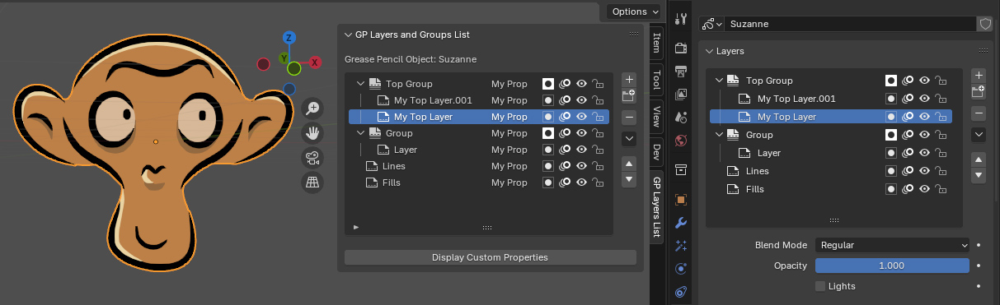

# GP3 Layers Template List

A template list to mimic the layers and layer groups of a Grease Pencil V3 object in Blender 4.3+

In Blender 4.3, many features of the Grease Pencil objects, as well as their internal structure, have considerably changed compared
to the previous versions. The implementaiton is now based on what is called Grease Pencil V3.

Many cool new features have then been introduced, including the ability to have layer groups and a color associated to those layers and groups.

As an add-on developer, you may want to have the layers list displayed in a custom panel, and may want to modify some behaviors. Currently
this is not an easy task since there is no template list provided by default in the Python API of Blender 4.3 allowing that.

**This add-on is then an attempt to simply re-creates the list of the layers and layer groups of a Grease Pencil object in a custom panel.**

## Disclamer

This is an experimental add-on. I cannot be held responsible for any misuse of the product or loss of data.

This implementation do not pretend to be perfect. It faces some limitations due to the current state of the Python API. I hope these limitations can be overcome soon, either through improvements and fixes to the Python API or through workarounds.

Feel free to send me any issue you may face, as well as suggestions to improve this implementation.

## Download and Installation

Get the add-on package from the [Release page](https://github.com/werwack/gp3-layers-template-list/releases/).

Then open Blender 4.3, go to the Preference panel, Add-Ons section, then install the package thanks to the *Install From Disk...* 
dropdown component, at the top right side of the window.

## Use

Once installed, the add-on panel appears in the N-tabs of the viewport under the name "Layers List".

Click on it, and select a Grease Pencil object in the scene. The layers are then displayed in the add-on panel.

Layers and layer groups can be selected to set the active item, and they properties (mask, layer skin, visibility, lock) can be changed
from the panel.

Whenever the structure of the layers hierarchy is modified, when a layer or layer group is added, removed or moved for example, you have
to press the "Refresh Layer Tree" button in order to manually force an update of the layer tree displayed in the add-on.
This is a temporary limitation.

## Current limitations

At the moment this implementation is facing several limitations:

* **Whenever the layers structure of the Grease Pencil object is changed, a manual action has to be done to refresh the layers list.**
  Indeed, at the moment, the Python API is still not fully stable and has 2 issues preventing the layers structure to send notifications
  when it is changed (from an operator such as Add or Remove Layer, or from a drag and drop for example).

* **Layer and Layer Group colors are not supported**
  This will be the case on Blender 4.4.

* Drag and drop of layers and layer groups is not supported. This behavior is currently not supported by the template list component
  of the Python API.

* Empty layer groups may have a wrong position in the tree. This has no impact on the grease pencil object display though because
  they are empty.
